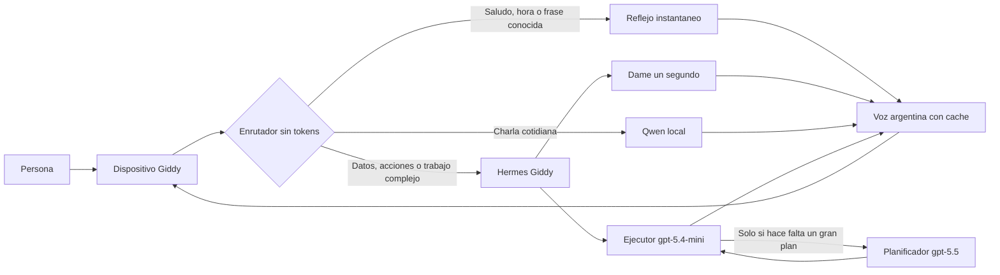

# Giddy como producto comercial

Giddy combina una interfaz fisica de voz y tacto con un Hermes dedicado. La
experiencia cotidiana busca tres cosas: responder rapido, gastar poco y conservar
la capacidad completa cuando una tarea realmente la necesita.

## Experiencia diaria

- La cara animada sigue siendo la vista principal.
- El boton `Hablar` inicia o corta una conversacion sin depender de la palabra de
  activacion.
- El boton `Hoy` abre un tablero tactil con agenda, prioridades, foco y clima.
- Las cuatro acciones se editan desde el panel web y cambian sin recompilar el
  firmware.
- La voz, velocidad, modo de costo y limites de contexto tambien se cambian desde
  el panel.



## Politica de costo

| Pedido | Ruta | Costo de modelo remoto |
|---|---|---:|
| Saludo, cortesia, hora, fecha o frase conocida | Reflejo instantaneo | Cero |
| Charla breve o explicacion simple | Qwen local | Cero |
| Chiste, adivinanza o trabalenguas | Biblioteca local curada | Cero |
| Agenda, clima, memoria, archivo o accion | Hermes | Segun uso |
| Analisis, decision, codigo o entregable | Hermes | Segun uso |
| Arquitectura o plan complejo | Planificador premium y ejecutor mini | Solo la planificacion |

El enrutador es determinista: elegir la ruta no consume tokens. En modo
`Ahorro`, los pedidos ambiguos permanecen locales. En `Maxima calidad`, los
pedidos ambiguos pasan a Hermes. Datos actuales, acciones, archivos y trabajos
complejos siempre usan Hermes, incluso en ahorro.

La charla libre que necesita el modelo local comienza directamente, sin la
muletilla `A ver`. Los trabajos que necesitan Hermes usan una frase configurable,
por defecto `Dame un segundo.`. Asi la persona recibe voz mientras el modelo y las
herramientas trabajan. Las frases publicas de los reflejos y esta confirmacion se
precalientan y se guardan como audio entre reinicios. La cache no acepta
respuestas personales ni contenido libre de una conversacion.

La biblioteca de reflejos es editable y puede crecer desde el panel: cada fila
define varias frases de entrada y una respuesta corta. Hora y fecha se calculan
en el momento con la zona horaria configurada y tampoco usan un modelo.

## Panel del producto

Abrir `http://127.0.0.1:8003/giddy`. La primera apertura requiere el token local
guardado en `server/data/giddy-setup-token.txt`; luego el navegador lo conserva
sin dejarlo visible en la direccion.

El panel incluye:

- estado de Hermes, modelo local y servicio de voz;
- porcentaje de respuestas instantaneas y de conversaciones sin costo de API;
- porcentaje de voz atendida desde la cache;
- modos Ahorro, Equilibrado y Maxima calidad;
- prueba previa de la ruta de cada frase;
- edicion de respuestas instantaneas, zona horaria y frases de charla/espera;
- interruptores para reflejos, aviso temprano y cache de voz;
- perfiles de voz Robot, Joven y Natural, con muestra, velocidad y tono;
- edicion de las cuatro acciones tactiles;
- limites de contexto y respuesta;
- informacion de conexion del dispositivo.

El token protege las APIs de configuracion. Las metricas no guardan mensajes:
solo ruta, motivo, tiempos, tamanos y un hash corto de sesion.

## Aislamiento y potencia

El tenant `giddy` no comparte WhatsApp, rutas MCP ni credenciales de otros
clientes. Su modelo principal es `gpt-5.4-mini` con razonamiento bajo. Puede
pedir una unica planificacion a `gpt-5.5` con razonamiento alto; el planificador
no hereda MCP, no aprueba acciones y no puede crear otros agentes. El ejecutor
mini aplica y verifica el plan.

La politica se puede reaplicar sin crear backups ni tocar memoria o sesiones:

```powershell
docker cp server/configure-giddy-tenant.py hermes-giddy:/tmp/configure-giddy-tenant.py
docker exec -u 0 hermes-giddy /opt/hermes/.venv/bin/python /tmp/configure-giddy-tenant.py --root /opt/data
```

## Recuperacion automatica

La tarea de Windows `Giddy Commercial Assistant` corre al iniciar sesion y cada
hora. Comprueba el servidor de voz, Ollama y Hermes. Si Docker Desktop todavia
esta arrancando, reintenta durante diez minutos. El contenedor usa la politica
`unless-stopped`.

Reinstalar la tarea es idempotente:

```powershell
powershell -ExecutionPolicy Bypass -File server/install-giddy-startup.ps1
```

## Limite fisico actual

La interfaz de 240 por 240 esta implementada para la Waveshare
ESP32-S3-Touch-LCD-1.54. Hace falta una primera compilacion y grabacion por cable
con ESP-IDF 5.5.2. Despues, las versiones de firmware pueden entregarse por OTA y
las acciones/configuracion cotidiana se cambian desde el panel sin cable.

## Movimiento y memoria

### Estados de interaccion

Giddy conserva tres estados claros y mutuamente excluyentes:

| Estado | Que escucha | Que reproduce | Como sale |
|---|---|---|---|
| Charla | La conversacion completa | Voz, musica y resultados solicitados | Una despedida o un pedido de silencio cambia el estado |
| Escucha silenciosa | La conversacion completa | Musica y acciones solicitadas, pero nunca voz sintetizada | Decir `Giddy` restaura la charla; una orden despues de `Giddy` se ejecuta en el mismo turno |
| Dormido | Solo la palabra local `Giddy` y el acelerometro | Nada | Decir `Giddy` o sacudirlo abre una conversacion nueva |

`Callate`, `dormite`, `no me escuches`, `chau Giddy` y despedidas equivalentes
duermen el dispositivo y cierran el canal de audio. `Escuchame pero no me hables`,
`no me hables` y `modo silencioso` conservan el canal para que pueda ejecutar
musica, imagenes y herramientas sin comentarios de voz.

La placa usa su QMI8658 para mantener la cara derecha al apoyar el dispositivo
sobre cualquiera de sus cuatro lados. Se exige una orientacion estable durante
varias muestras para que una vibracion breve no haga saltar la imagen.

Dos picos de movimiento consecutivos despiertan el reposo visual y tienen dos
segundos de bloqueo para evitar activaciones repetidas. El apagado profundo corta
la alimentacion del sensor y solo puede despertarse con el boton PWR.

El gadget publica `self.system.get_memory` para consultar RAM interna, PSRAM y
flash libres en vivo. La placa tiene 512 KB de SRAM interna, 8 MB de PSRAM y
16 MB de flash; la cifra util cambia durante audio, animaciones y conversacion.
